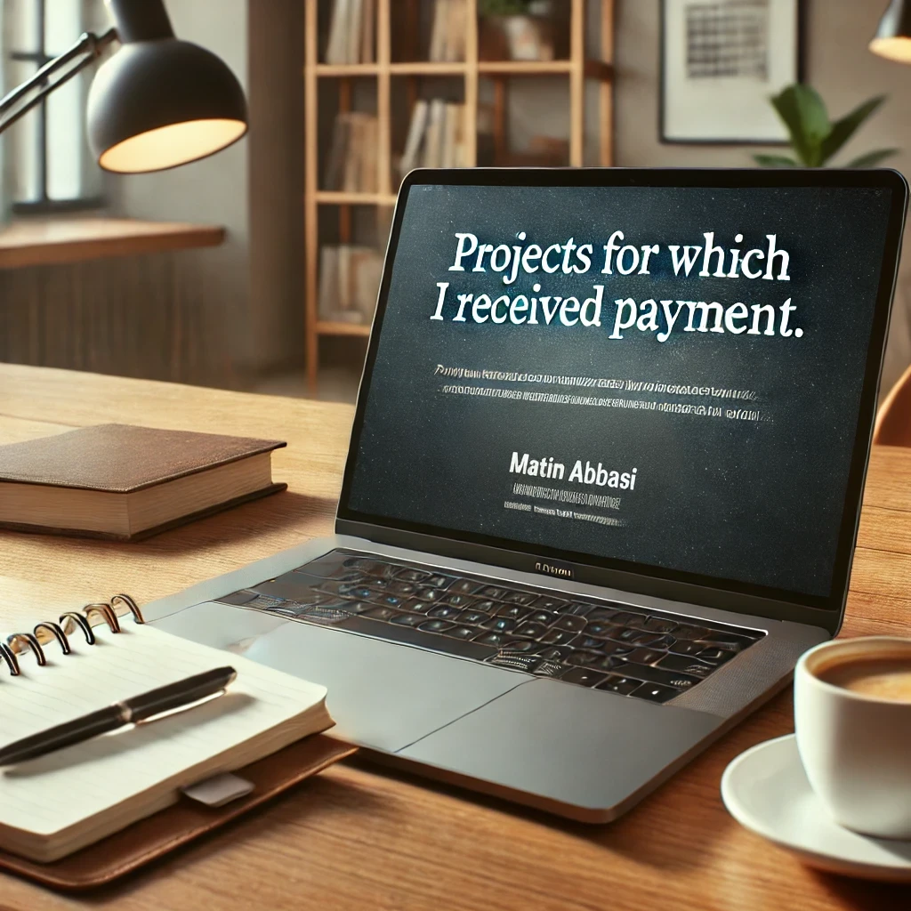

# Projects for which I received payment.

List of projects
***
* [emailchecker 70$](https://github.com/matinabbasi/projects/tree/main/emailchecker/)
* [musicplayer 10$](https://github.com/matinabbasi/projects/tree/main/musicplayer/)
* [university_map 10$](https://github.com/matinabbasi/projects/tree/main/university_map/)

My goals for sharing these projects are as follows:

1. To continue and grow the projects as open-source.
2. They might be helpful to someone.
3. To demonstrate how I manage and advance projects.
4. For fun.

