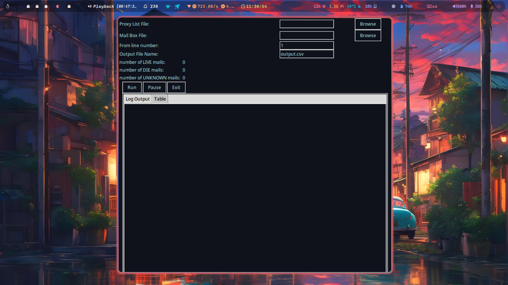

### This is an email checker program that not only verifies if an email is written correctly but also checks its existence using the SMTP protocol.

It includes two applications: CLI and GUI.

!!! I received 35,000,000 Iranina Rials, equivalent to 70 dollars, for this program.

It took me about a month to complete.

I heavily relied on the internet and ChatGPT for writing it, and I found the main idea for checking emails with the help of Stack Overflow.

#### Screenshots
* GUI

If you find this program useful, I'd be happy to further develop it.